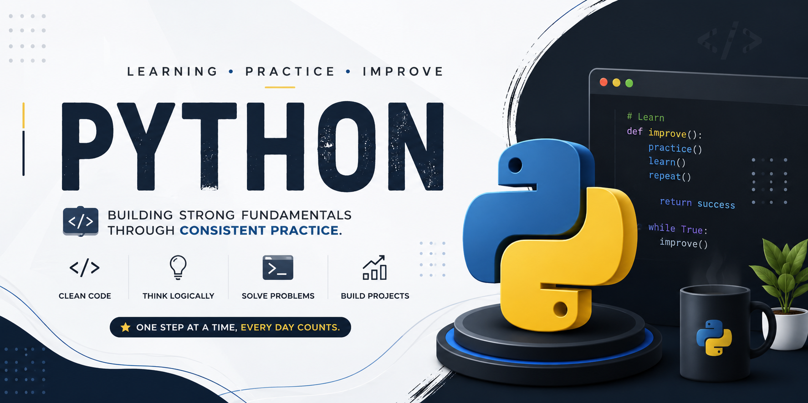

# 🐍 Python Learning & Practice

<p align="center">
  
</p>

<p align="center">
  <b>Learning Python • Practicing • Building • Improving</b>
</p>

---

## 📖 About This Repository

This repository contains my Python learning journey, practice programs,
exercises, and notes from the Python course I completed on Udemy.

My goal is to strengthen my Python fundamentals by understanding concepts,
writing code, and practising consistently.

---

## 🎯 Goals

- 🐍 Build strong Python fundamentals
- 🧠 Improve problem-solving skills
- 💻 Write clean and understandable code
- 🔨 Build small Python projects
- 🚀 Prepare for DSA and real-world development

---

## 🛠️ Tech Stack

<p align="center">
  
</p>

---

## 📚 Topics Covered

### 🟢 Python Basics
- Variables
- Data Types
- Operators
- Input & Output
- Type Casting
- Strings

### 🔄 Control Flow
- `if`, `elif`, `else`
- `for` loops
- `while` loops
- `break`
- `continue`

### 📦 Data Structures
- Lists
- Tuples
- Sets
- Dictionaries
- List Comprehension

### ⚙️ Functions
- Functions
- Parameters & Arguments
- Return Values
- `*args` & `**kwargs`
- Lambda Functions
- Scope

### 🏗️ Object-Oriented Programming
- Classes & Objects
- Constructors
- Methods
- Inheritance
- Polymorphism
- Encapsulation

### 🧩 Python Concepts
- Mutability & Immutability
- References
- Iterables
- Iterators
- Generators
- Exception Handling
- Modules & Packages
- Virtual Environments

### 📁 File Handling
- Reading Files
- Writing Files
- CSV
- JSON

---

## 📈 Learning Progress

| Topic | Status |
|---|---|
| Python Fundamentals | ✅ Completed |
| Control Flow | ✅ Completed |
| Data Structures | ✅ Completed |
| Functions | ✅ Completed |
| OOP | ✅ Completed |
| File Handling | ✅ Completed |
| Python Concepts | ✅ Completed |
| Practice | 🔄 Ongoing |
| Projects | 🔄 Ongoing |

---

## 🧠 My Learning Process

```text
Learn
  ↓
Understand
  ↓
Code It Myself
  ↓
Practice
  ↓
Debug Mistakes
  ↓
Revise
  ↓
Build Projects